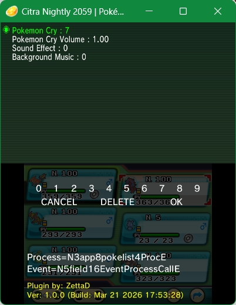
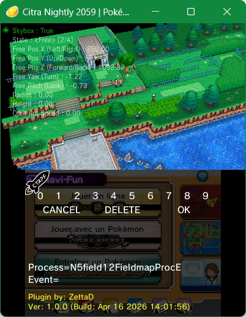
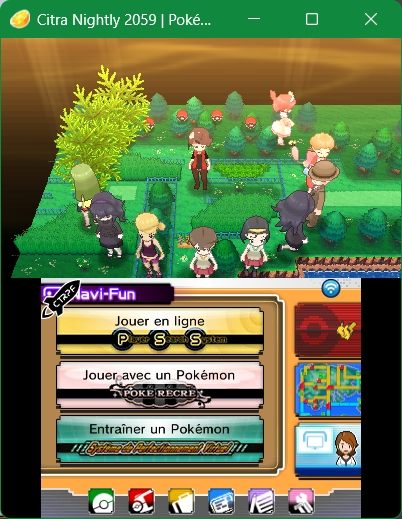
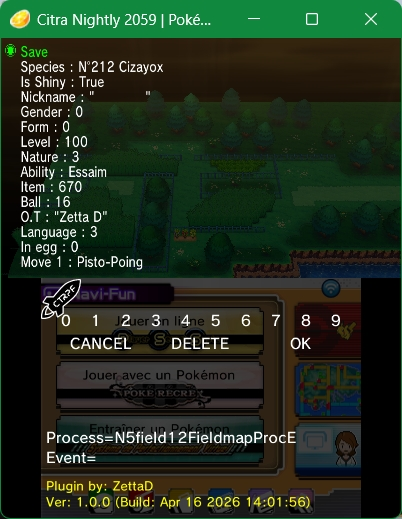

# Sango Plugin

  
  
  
  

---

## ⚠️ Important Compatibility Note

All **reverse engineering** for this project was performed exclusively on **Pokémon Alpha Sapphire v1.4**.

---

## Description

**Sango Plugin** is a C++ framework (currently under development) designed to interact directly with the game engine.

---

## 🔧 Dependencies & Build

This plugin is designed to be **fully standalone**:

* ❌ Does **not rely on libraries** such as `libctrpf` or `libctru`

Instead, the plugin **relies entirely on the game's own code and internal libraries**.  
All core operations (file handling, rendering, input, etc.) are performed by directly calling **game functions**, not
external SDK libraries.

However, to compile the project, you will still need:

* ✅ **devkitPro** (required toolchain for Nintendo 3DS development)

### Build Pipeline

Once compiled, the resulting `.elf` file must be converted into an **Action Replay cheat code**.

For this purpose, a dedicated tool is required:

➡️ **elf2arcc**  
https://github.com/David-Darras/elf2arcc

Use the generated code with Rosalina or Citra.

---

## Repository Structure

* `include/`: Header files (Class definitions, memory addresses, and data structures).
* `src/`: Core implementation (Menu logic, hook applications, and the `crt0.s` entry point).

---

## Author

* **David Darras** (ZettaD)