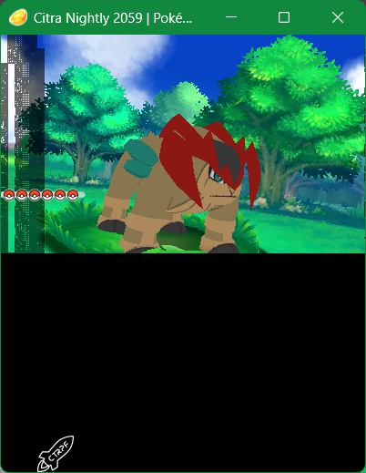

# Sango Plugin (v2.0.0) | A new CTRPF for Pokémon ORAS

  
  
  
  

---

## Compatibility

All reverse engineering and features are built **exclusively for Pokémon Alpha Sapphire v1.4**.

---

## Description

**Sango Plugin** is a C++ framework designed to interact directly with the game engine.

**Update v2.0.0:** Due to size constraints, the project is no longer injected as an Action Replay cheat code. It has
been fully migrated to a standard **`.3gx` plugin format**.

---

## Build & Usage

**To compile:**
You will need **devkitPro**, as well as the following resources provided by the **thepixellizeross** team:

* **[libctrpf](https://gitlab.com/thepixellizeross/ctrpluginframework/-/releases)**
* **[3gxtool](https://gitlab.com/thepixellizeross/3gxtool/-/releases/v1.2)**

**To use:**
Put the `sango_plugin.3gx` file in the `luma/plugins/000400000011C500` folder.

---

## Repository Structure

* `include/`: Header files (Memory addresses, data structures, and game classes).
* `src/`: Menu implementation and hooks.

---

## Author

* **David Darras** (ZettaD)