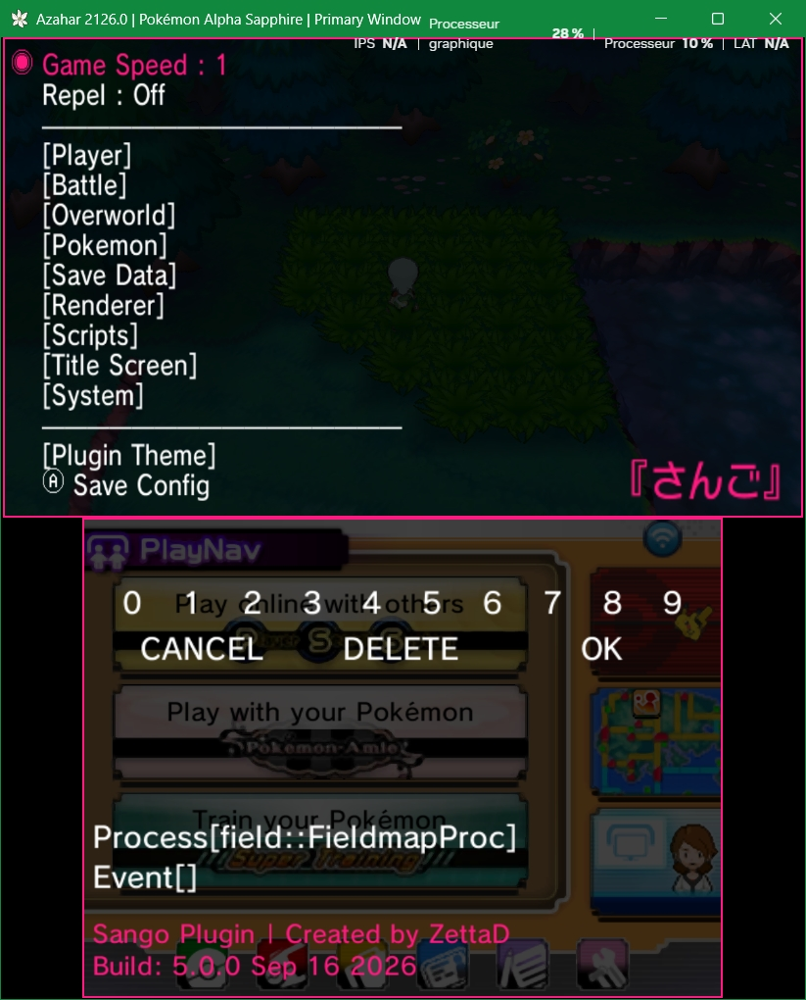

<div align="center">

# Sango Plugin (v5.0.0) | A C++ framework for Pokémon ORAS




</div>

---

## What it is

**Sango Plugin** is a `.3gx` plugin framework (built on
[CTRPluginFramework](https://gitlab.com/thepixellizeross/ctrpluginframework))
that talks directly to the engine of **Pokémon Alpha Sapphire v1.4**: its
memory, its structures, its functions. Everything reverse engineered lives in
one library, and several plugins are built on top of it:

| Product | Output | What it is |
|---|---|---|
| `overlay` | `sango_plugin.3gx` | Every page of the library under one menu: explore and edit the game while it runs (battle, overworld, Pokémon data, save data, renderer, scripts...). |
| `kaizo` | `sango_kaizo.3gx` | **[Pokémon Sango Kaizo](kaizo.md)**, the ROM hack: Nuzlocke rules, competitive trainers, custom moves and abilities, QoL. |
| `undertow` | `sango_undertow.3gx` | **Pokémon Undertow**: the game played from Team Aqua's side, as a grunt. |

Only Alpha Sapphire v1.4 is supported today. Every address is declared for
both games (`GAME_ADDRESS(xy, oras)`), so an X/Y port only needs the
addresses filled in.

---

## Build

You need [devkitPro](https://devkitpro.org/wiki/Getting_Started) (devkitARM +
libctru) and two tools from the **thepixellizeross** team, installed in the
devkitPro tree:

* [libctrpf](https://gitlab.com/thepixellizeross/ctrpluginframework/-/releases)
* [3gxtool](https://gitlab.com/thepixellizeross/3gxtool/-/releases/v1.2)

Then, from the devkitPro shell (msys2 on Windows):

```bash
make            # all three products
make overlay    # or kaizo, undertow: one product
make clean
```

Each product is built in its own `release-<product>/` directory; the `.3gx`
land at the repository root. `make run-<product>` (or `make relink` for the
overlay) builds one product, copies it where the emulator loads it and starts
the game: set `DEST`, `EMULATOR` and `GAME_PATH` at the top of the `Makefile`
first.

The game is selected by `-DGAME_ORAS` (default) or `-DGAME_XY` in the
`CFLAGS`. The language is gnu++11 with `-fno-rtti -fno-exceptions`: no
exceptions, no RTTI, no `std::string`; keep it that way, the plugin runs in
the game's process with a few hundred KB.

## Install

Copy the `.3gx` you built to the SD card, in
`luma/plugins/000400000011C500/`, **renamed to `sango_plugin.3gx`** (one
plugin per title, whichever product it is). Enable plugin loading in Luma3DS
(or in Citra / Azahar) and start the game.

---

## Repository layout

```
lib/          the shared library: everything reverse engineered + the menu framework
  include/    headers, one directory per domain
  src/        sources, same domains, flat
overlay/      sango_plugin.3gx: entrypoint, root page, C++ scripts
kaizo/        sango_kaizo.3gx: the ROM hack
undertow/     sango_undertow.3gx
assets/       screenshots
docs/         decompiled sources and IDA exports used for reverse engineering
```

The library never decides anything on its own: a product enables the features
it wants, sets their options and installs its callbacks (see
`*/src/entrypoint.cc`, `lib/include/plugin.h`).

### Domains

Every directory of `lib/include/` is a namespace: `core/` (engine, processes,
hooks, plugin infrastructure), `system/` (`sys::` device, files, graphics,
sound), `battle/`, `overworld/`, `pokemon/`, `savedata/`, `renderer/`,
`script/`, `ui/`. Inside a domain, the same four things always sit in the
same place:

| Path | Contents |
|---|---|
| `<domain>/address.h` | The game's addresses, one file per domain, each declared as `constexpr uptr kName = GAME_ADDRESS(xy, oras);`. |
| `<domain>/constant/` | The enum classes, **one per file**. Ids of open game tables end in `Id` (`SpeciesId`, `ItemId`, `MapId`...), closed vocabularies don't (`Nature`, `Gender`, `Format`, `StatusCondition`...). |
| `<domain>/native/` | The game's own structures, laid out as in memory, **one per file**, checked by `static_assert` on sizes and offsets. Only families that make no sense apart share a file (the battle mutations, the PSS payloads, the GARC sections, the AMX structures). |
| `<domain>/patch/` | What the plugin adds: hooks, patches and their options (`battle::Battle`, `overworld::Camera`, `pokemon::CustomShop`...). Pure hooks without options are suffixed `Patch`. |

`ui/` is a special case: its root is the plugin's own menu framework
(`MainApplication`, `PageItem`, the widgets), `ui/page/` the menu pages,
`ui/native/` the game's layout manager and `ui/patch/` the patches of the
game's screens. `common.h` is the umbrella every file includes: types, macros,
the address tables and the four structures shared by every domain (`String`,
`Message`, `Bundle`, `PokeInfo`).

### Conventions

* **Enum classes everywhere.** A field that holds an id has the enum class
  type, with the exact width the game uses (`SpeciesId : u16`, `Form : u8`,
  bitfields when the game packs them). No raw integer, no `static_cast` at the
  call site.
* **Game structures are honest.** Unknown bytes are `_0`, `_1`... padding
  arrays; every offset the plugin relies on is asserted. Game functions are
  called through typed function-pointer casts on `address::kName`.
* **Features are singletons.** `MAKE_SINGLETON(Name)` for the plugin's own
  classes, `SINGLETON(Name)` + a `GetInstance()` that reads the game's
  pointer for game structures. Options that survive a restart live in a
  standard-layout `*Settings` base struct: `ConfigManager` saves and loads
  them, and only them (`kConfigVersion` bumps when a layout changes).
* **Hooks** are registered with `core::HookManager::Initialize(HookId, src,
  dst)` and call the original through `HookManager::Call<R>(...)`; one
  `HookId` per hook in `core/constant/hook_id.h`.
* **Menu pages** are `void LoadXxxPage(MainApplication&, void*)` functions in
  `lib/src/ui/page/`, declared in `ui/page/pages.h`, chaining
  `app.Add(...).WithBounds(...).WithCallback(...)`. Pages that need the
  overworld or a battle check the process themselves (`app.CheckProcess`).
* **Style**: Google-ish, 2 spaces, 80 columns, `snake_case` fields,
  `PascalCase` types and functions, `kConstant`. Comments explain what the
  name can't (offsets, game names, gotchas), never restate it. Repository
  files are in English, CRLF.

### Adding things

* **A game structure**: `<domain>/native/thing.h`, `namespace <domain>`,
  fields typed with the enum classes of `constant/`, `static_assert` the size.
* **An enum class**: `<domain>/constant/thing.h`; add `using domain::Thing;`
  at the end only if it is used across domains.
* **A hook**: a `HookId`, the address in `<domain>/address.h`, the class in
  `<domain>/patch/`, `Initialize()` called from the product's entrypoint.
* **A menu page**: the function in `lib/src/ui/page/page_<family>.cc`, its
  declaration in `pages.h`, one `Add` in the family's root page.

---

## Author

* **David Darras** (ZettaD)
