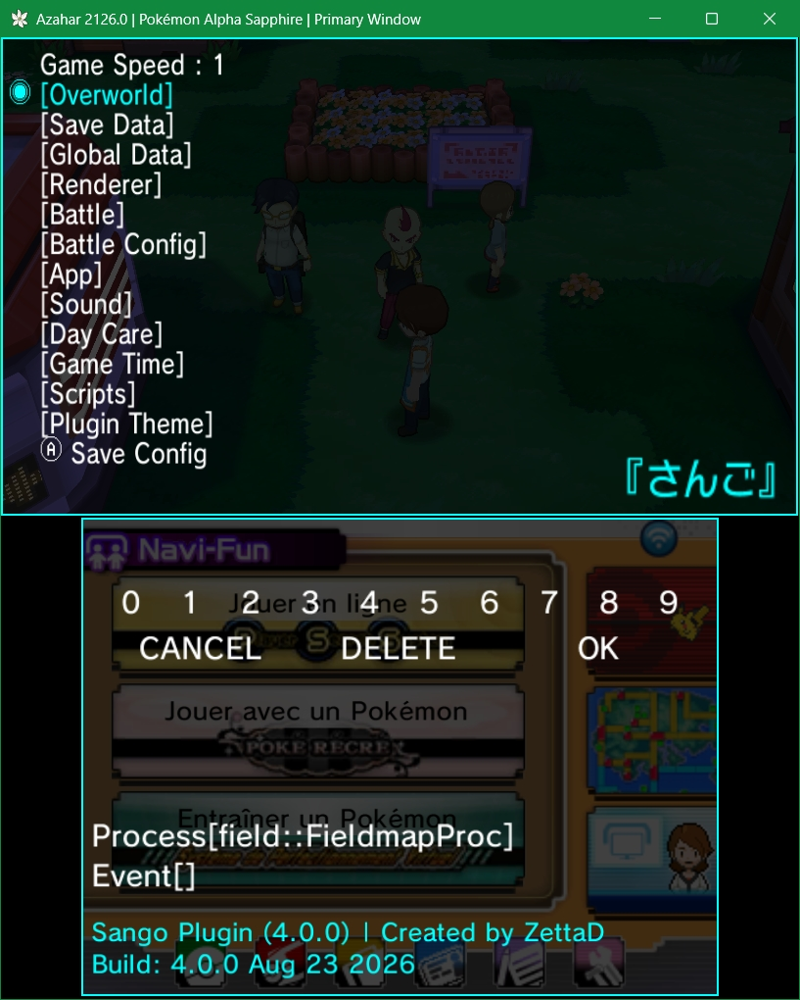
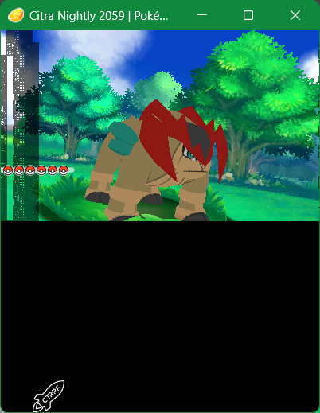
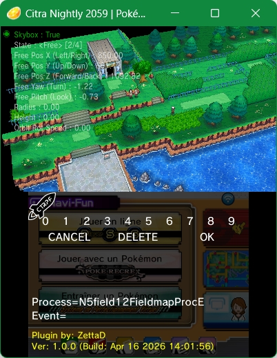
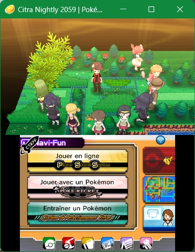

# Sango Plugin (v4.1.0) | A new CTRPF for Pokémon ORAS

  
  
  
  

---

## Compatibility

All reverse engineering and features are built **exclusively for Pokémon Alpha Sapphire v1.4**.

---

## Description

**Sango Plugin** is a C++ framework designed to interact directly with the game engine.

**Update v2.0.0:** Due to size constraints, the project is no longer injected as an Action Replay cheat code. It has
been fully migrated to a standard **`.3gx` plugin format**.

---

## Pokémon Sango Kaizo (ROM Hack)

Check out my flagship mod built using this framework: **[Pokémon Sango Kaizo (Demo)](kaizo.md)** - a complete overhaul featuring hardcoded Nuzlocke rules, live stat editing, competitive AI, and custom QoL features!

---

## Build & Usage

**To compile:**
You will need **devkitPro**, as well as the following resources provided by the **thepixellizeross** team:

* **[libctrpf](https://gitlab.com/thepixellizeross/ctrpluginframework/-/releases)**
* **[3gxtool](https://gitlab.com/thepixellizeross/3gxtool/-/releases/v1.2)**

**To use:**
Put the `.3gx` you built (`sango_plugin.3gx` or `sango_kaizo.3gx`) in the `luma/plugins/000400000011C500` folder, renamed to `sango_plugin.3gx`.

---

## Repository Structure

One library, several plugins built on it — `make` builds them all,
`make overlay` or `make kaizo` just one.

* `lib/`: the engine every plugin shares — memory addresses, game structures,
  features (hooks), the menu framework and its pages, C++ field scripts. It
  never decides anything on its own: a plugin enables features and installs
  callbacks (`plugin.h`).
* `overlay/`: `sango_plugin.3gx`, every page of the library under one menu, for
  exploring and editing the game while it runs.
* `kaizo/`: `sango_kaizo.3gx`, the ROM hack.

---

## Author

* **David Darras** (ZettaD)