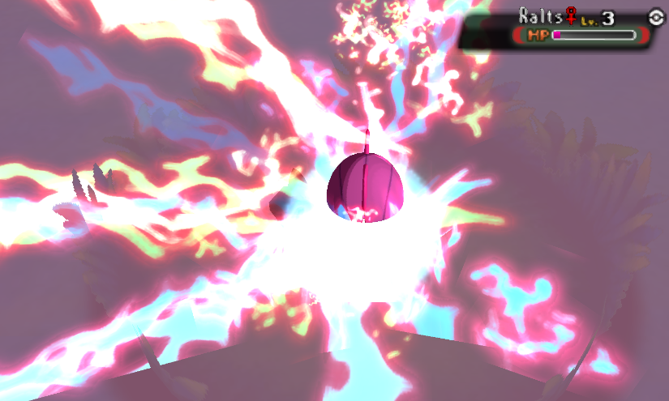
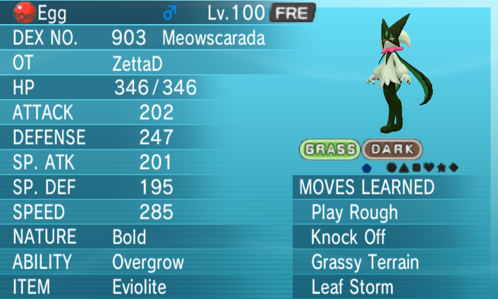
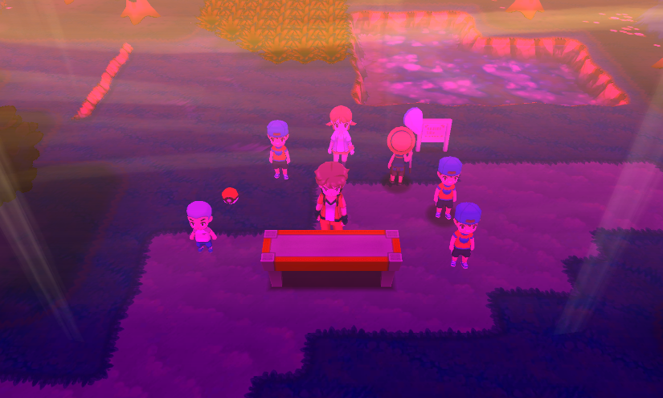
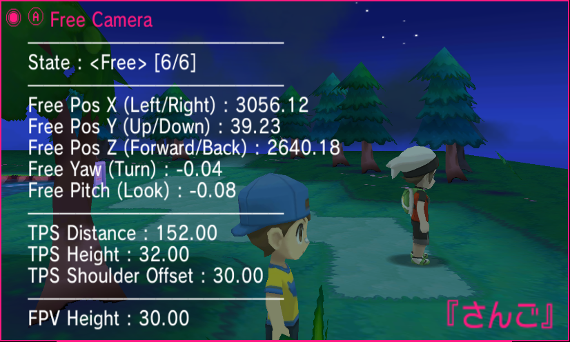
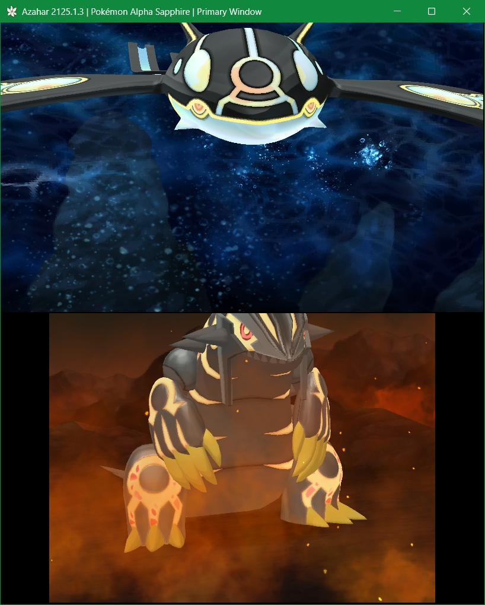
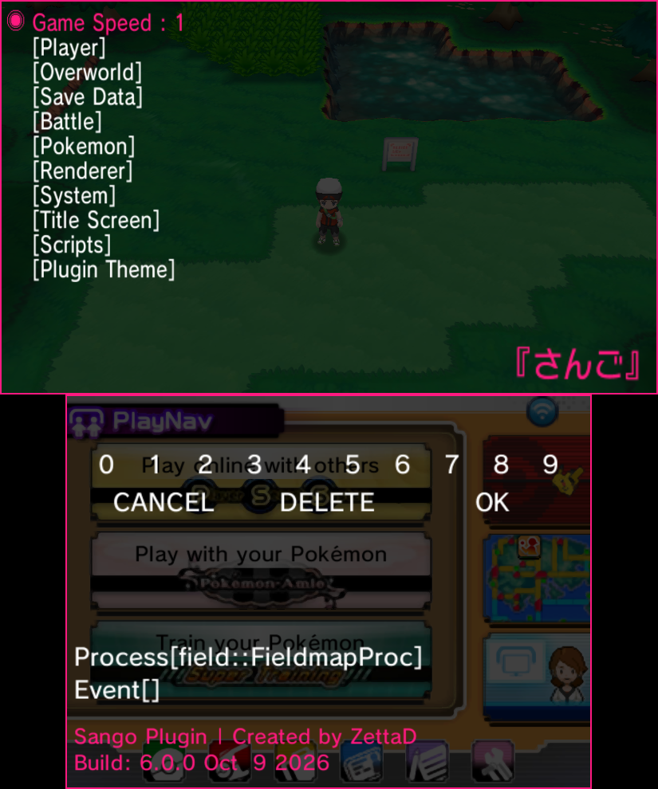

<div align="center">

# Sango Plugin

### Make your own Pokémon Alpha Sapphire ROM hack, in C++, without changing a single game file.


**[Documentation](docs/README.md)** ·
**[Install the tools](docs/getting-started/01-install-the-tools.md)** ·
**[Tutorials](docs/tutorials/README.md)** ·
**[Glossary](docs/reference/glossary.md)**

</div>

---

## What is Sango Plugin?

Sango Plugin is a C++ library for **Pokémon Alpha Sapphire v1.4**.
It runs inside the game as a `.3gx` plugin (with Luma3DS on a 3DS, or with the Azahar emulator).

It changes the game **in memory**, while the game runs:

- No ROM to patch, no `romfs` to rebuild, no game file to share.
- Your ROM hack is one small `.3gx` file. The player keeps their own legal copy of the game.
- You write normal C++: the library already knows the structures, the functions and the addresses of the game.

```cpp
// A new move, with its data, its effect and its animation.
battle::GameExtension::AddMove(
    {kMoveThunderclap, u"Thunderclap", u"A fast electric attack.\nIt calls the rain.",
     PatchThunderclapData, UseThunderShockAnimation,
     kThunderclapReactions, SIZE(kThunderclapReactions)});

// New wild Pokémon on Route 101.
overworld::WildEncounter::GetInstance().on_wild_pokemon = OnWildPokemon;

// A new character with a C++ script.
script::NativeScript::Register(kCandyGiver, CandyGiver);
```

---

## Features

<table>
<tr>
<td width="50%" valign="top">

### ⚔️ Battle
- **New moves and new abilities** with their own effects
- **Move animation editor**: change, recolor or build animations step by step
- Trainer teams with EVs, natures, items and AI
- Double, triple, rotation and horde battles anywhere
- Type chart editor, inverse battles, Metronome-only battles
- Unlimited Mega Evolutions

</td>
<td width="50%" valign="top">



</td>
</tr>
<tr>
<td width="50%" valign="top">



</td>
<td width="50%" valign="top">

### 🐉 Pokémon
- **Generation VII, VIII and IX Pokémon** in the game
- Alolan forms, **Legends: Z-A Mega Evolutions**, Gigantamax forms
- Shiny rate, evolutions, Mega Evolution table
- Species and move data editor
- Poké Marts that sell Pokémon

</td>
</tr>
<tr>
<td width="50%" valign="top">

### 🗺️ Overworld
- **C++ scripts**: new characters, dialogues, gifts and events
- **Free camera**, first-person view, top view
- **Multiplayer**: see other players walk in your world
- 3D tall grass, hidden items, Secret Base decorations everywhere
- Weather, time of day, wild Pokémon, gift Pokémon, in-game trades
- Field moves from the menu, auto-Surf

</td>
<td width="50%" valign="top">



</td>
</tr>
<tr>
<td width="50%" valign="top">



</td>
<td width="50%" valign="top">

### 🛠️ For ROM hack makers
- **12 step-by-step tutorials** for beginners
- An in-game menu to explore and edit everything while the game runs
- Typed game structures, documented with Doxygen
- One library, as many ROM hacks as you want
- Experimental support of Pokémon X v1.5

</td>
</tr>
</table>

---

## ROM hacks made with Sango Plugin

| | Product | Description |
|---|---|---|
|  | **[Pokémon Sango Kaizo](kaizo.md)** (`kaizo/`) | A difficult version of Alpha Sapphire: Nuzlocke rules, level caps, competitive trainers, custom moves and abilities, quality-of-life features. |
|  | **Pokémon Undertow** (`undertow/`) | Play as a Team Aqua grunt. Work in progress. |
|  | **The overlay** (`overlay/`) | Every page of the library in one menu. Explore and test the game. |

Your ROM hack is the next line of this table. **[Start here.](docs/tutorials/01-create-your-rom-hack.md)**

---

## Quick start

You need [devkitPro](https://devkitpro.org), [libctrpf](https://gitlab.com/thepixellizeross/ctrpluginframework)
and [3gxtool](https://gitlab.com/thepixellizeross/3gxtool).
The [installation guide](docs/getting-started/01-install-the-tools.md) explains each step for Windows and Linux.

```bash
git clone https://github.com/David-Darras/sango-plugin.git
cd sango-plugin
make
```

Copy `sango_plugin-release.3gx` to `luma/plugins/000400000011C500/` on the SD card,
enable the plugin loader and start Alpha Sapphire v1.4. Press **Start** to open the menu.
See [Run the plugin](docs/getting-started/03-run-the-plugin.md).

---

## Documentation

| | |
|---|---|
| **[Getting started](docs/README.md#getting-started)** | Install the tools, build, run, set up your editor. |
| **[Concepts](docs/README.md#concepts)** | Architecture, hooks, game structures, battle engine, scripts, menu. |
| **[Tutorials](docs/tutorials/README.md)** | Your ROM hack, menu pages, hooks, moves, abilities, animations, wild Pokémon, trainers, scripts, models, items. |
| **[Glossary](docs/reference/glossary.md)** | The meaning of each term. |
| **API reference** | Type `doxygen` in the project folder. |

## Project layout

```
lib/          the library: all the features and the game structures
  include/    the headers, one folder for each domain (battle, overworld, pokemon...)
  src/        the sources
overlay/      the overlay: all the pages in one menu
kaizo/        Pokémon Sango Kaizo
undertow/     Pokémon Undertow
docs/         the documentation and the tutorials
tools/        helper scripts (multiplayer relay)
```

## Supported games

| Game | Version | Status |
|---|---|---|
| Pokémon Alpha Sapphire | 1.4 | Supported |
| Pokémon X | 1.5 | Experimental (overlay only, `make GAME=XY`) |

---

## Credits

- **David Darras (ZettaD)**: author.
- [CTRPluginFramework](https://gitlab.com/thepixellizeross/ctrpluginframework) and
  [3gxtool](https://gitlab.com/thepixellizeross/3gxtool) by ThePixellizerOSS.
- [Luma3DS](https://github.com/LumaTeam/Luma3DS), [devkitPro](https://devkitpro.org) and [Azahar](https://azahar-emu.org).
- The names of the game come from [Bulbapedia](https://bulbapedia.bulbagarden.net).

## License

Sango Plugin is free software under the [GNU General Public License v3.0](LICENSE).

Pokémon and all the related names are trademarks of Nintendo, Game Freak and
The Pokémon Company. This project is not affiliated with them.
It does not contain the game: use your own copy of the game.
