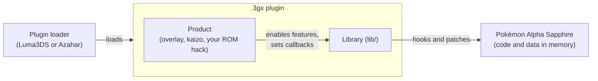
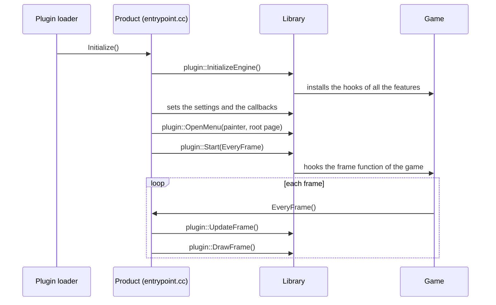

# Architecture

This page explains how the project is organized and how the plugin runs.
Read it before the tutorials.

## The big picture



1. The plugin loader starts the game and loads the `.3gx` file.
2. The plugin runs inside the memory of the game.
3. The library changes the game with **hooks** and **patches**.
4. The product tells the library what to change.

The game files on the cartridge never change. All the changes are in memory.
When you remove the plugin, the game is normal again.

## The folders

```
lib/              the library: all the features and all the game structures
  include/        the headers, one folder for each domain
  src/            the sources, one folder for each domain
overlay/          the overlay product: all the pages in one menu
kaizo/            the kaizo product: the ROM hack Pokémon Sango Kaizo
undertow/         the undertow product: the ROM hack Pokémon Undertow
docs/             this documentation
assets/           images and data files
tools/            helper scripts (online mode)
Makefile          the build file
Doxyfile          the settings of the API reference
```

Your ROM hack is a new product folder next to `kaizo/`.
See [Create your ROM hack](../tutorials/01-create-your-rom-hack.md).

## The domains

Each folder of `lib/include/` is a **domain**. Each domain is also a C++ namespace.

| Domain | Namespace | Contents |
|---|---|---|
| `core/` | `core::` | Hooks, memory, processes, archives, events, cheat codes. |
| `system/` | `sys::` | Buttons, files, graphics, sound, text. |
| `battle/` | `battle::` | Battles, moves, abilities, move animations, trainers. |
| `overworld/` | `overworld::` | Maps, characters, camera, weather, encounters. |
| `pokemon/` | `pokemon::` | Species, forms, items, evolutions, Mega Evolutions, shops. |
| `savedata/` | `savedata::` | The save data: party, PC boxes, Bag, Pokédex, records. |
| `renderer/` | `renderer::` | 3D models, textures, lights, filters. |
| `script/` | `script::` | The game scripts and the C++ scripts. |
| `ui/` | `ui::` | The menu of the plugin and the patches of the game screens. |
| `net/` | `net::` | The online mode (other players in the overworld). |

## Inside a domain

Each domain uses the same four places:

| Place | Contents | Example |
|---|---|---|
| `<domain>/address.h` | The addresses of the game for this domain. | `battle/address.h` |
| `<domain>/constant/` | The enum classes: one enum in each file. | `pokemon/constant/species.h` |
| `<domain>/native/` | The game structures: one structure in each file. | `pokemon/native/core_data.h` |
| `<domain>/patch/` | The features of the plugin: hooks, patches and their settings. | `battle/patch/battle.h` |

The `ui/` domain also has the menu framework at its root (`main_application.h`,
`page_item.h`, the widgets) and the menu pages in `ui/page/`.

Two files are at the root of `lib/include/`:

- `common.h`: include it in every file. It contains the base types, the macros and the addresses.
- `plugin.h`: the functions that a product calls to start the plugin.

## The start of the plugin



The `Initialize()` function of a product looks like this:

```cpp
void Initialize() {
  plugin::InitializeEngine();      // 1. Installs the features.
  InstallCallbacks();              // 2. Your settings and callbacks.
  plugin::OpenMenu(ui::MainAppPainter::GetInstance(), LoadMyRootPage);
  plugin::Start(EveryFrame);       // 3. Runs EveryFrame() at each frame.
}

void EveryFrame() {
  plugin::UpdateFrame();           // Reads the buttons, updates the menu.
  // Your code for each frame.
  plugin::DrawFrame();             // Draws the menu.
}
```

## The processes

The game runs one main **process** at a time: the title screen, the overworld,
a battle, the summary screen...

When a process starts, `core::ProcessPatch` calls the patches of this process.
For example, `battle::Battle::PatchLoad()` runs when a battle starts.

A product can also react to a new process with the callback
`core::ProcessPatch::GetInstance().on_process_load`.

The battle code is a **CRO**: the game loads it only during a battle.
Hooks in a CRO are installed disabled. The library enables them when the CRO is in memory.

## How a product talks to the library

A product never changes the files of `lib/`. It uses four tools:

| Tool | Example |
|---|---|
| **Settings** of a feature | `battle::Battle::GetInstance().unlimited_mega_evolution = false;` |
| **Callbacks** of a feature | `overworld::WildEncounter::GetInstance().on_wild_pokemon = MyFunction;` |
| **Add / Register** functions | `battle::GameExtension::AddMove(...)`, `script::NativeScript::Register(...)` |
| **Pages** of the menu | `app.Add("Battle", ui::LoadBattlePage);` |

If the library does not have the tool that you need, add a feature to the library.
See [Add a hook](../tutorials/03-add-a-hook.md).

## Related pages

- [Hooks and addresses](hooks-and-addresses.md)
- [Game structures](game-structures.md)
- [The battle engine](battle-engine.md)
- [Scripts](scripts.md)
- [The menu](menu.md)
- [Settings](settings.md)
