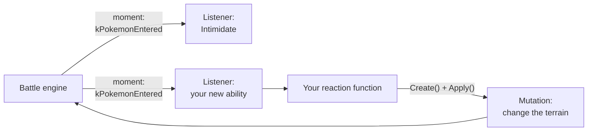

# The battle engine

This page explains how the battle code of the game works.
You need it to make a new move or a new ability.

## Events and listeners

The battle code sends an event at each important time of a battle:
"a Pokémon enters the battle", "a move starts", "the damage is calculated"...
In the code, such a time is a **moment** (`battle::MomentKind`).

A **listener** waits for some moments. Each ability, move, item and status
condition in the battle has a listener.

A listener contains a **reaction table** (`battle::ReactionTable`): a list of
pairs {moment, reaction}. A **reaction** is a function. The battle code calls it
at its moment.



## Reactions

A reaction has this signature:

```cpp
void MyReaction(battle::Listener* self, battle::Controller* controller,
                battle::UID owner, s32* local_state);
```

| Parameter | Meaning |
|---|---|
| `self` | The listener. |
| `controller` | The object that changes the battle. |
| `owner` | The battle id of the Pokémon that owns the ability or that uses the move. |
| `local_state` | Seven numbers that the listener keeps between two calls. Use them for a counter, for example. |

The same moment can come from different Pokémon. Check that the moment is for
your Pokémon:

```cpp
if (battle::Situation::Get(battle::SituationKey::kPokemonId) != owner.value) {
  return;  // The moment is for a different Pokémon.
}
```

## The situation

The **situation** (`battle::Situation`) contains the values of the current moment:
the Pokémon, the move, the targets, the damage...

```cpp
s32 user = battle::Situation::Get(battle::SituationKey::kMoveUserId);
s32 target_count = battle::Situation::Get(battle::SituationKey::kTargetCount);
```

The keys are in `lib/include/battle/constant/situation_key.h`.

## Mutations

A reaction does not change the battle directly. It asks the controller for a
**mutation**: a change request. Then it applies the mutation.

```cpp
// Make the request.
auto* mutation = static_cast<battle::AddFieldEffectMutation*>(
    controller->Create(battle::MutationKind::kAddFieldEffect, owner));

// Fill it.
mutation->show_ability_banner = true;
mutation->effect = battle::FieldEffectKind::kTerrain;
mutation->terrain = battle::TerrainKind::kElectricTerrain;

// Apply it.
controller->Apply(mutation);
```

The game shows the correct animations and messages for each mutation.

The mutation kinds are in `lib/include/battle/constant/mutation_kind.h`.
The mutation structures are in `lib/include/battle/native/mutation.h`.

| Mutation kind | Structure | What it does |
|---|---|---|
| `kInflictStatus` | `InflictStatusMutation` | Gives a status condition. |
| `kAdjustStatStage` | `AdjustStatStageMutation` | Raises or lowers a stat stage. |
| `kAdjustHpDirectly` | `AdjustHpDirectlyMutation` | Changes the HP. |
| `kChangeForm` | `ChangeFormMutation` | Changes the form. |
| `kChangeType` | `ChangeTypeMutation` | Changes the type. |
| `kAddFieldEffect` | `AddFieldEffectMutation` | Adds a terrain or a battlefield effect. |
| `kShowMessage` | `ShowMessageMutation` | Shows a message. |

The controller also has direct functions:

| Function | What it does |
|---|---|
| `controller->SetWeather(owner, weather, item, infinite)` | Changes the weather. |
| `controller->ExecuteMove(pokemon, move)` | Makes a Pokémon use a move. |
| `controller->GetPokemon(uid)` | Returns the data of a Pokémon in the battle (`battle::Pokemon`). |

## Battle ids

Each Pokémon in a battle has a battle id (`battle::UID`).
A battle has 4 clients at most. Each client has 6 ids:
`battle id = client × 6 + party slot`.

## Generation VI limits

The engine of Alpha Sapphire is the engine of generation VI.
Some later mechanics do not exist. For example, there is no Psychic Terrain
(`TerrainKind` has only Grassy, Misty and Electric).
A new ability can only use the mechanics of the engine.

## Related pages

- [Add a move](../tutorials/04-add-a-move.md)
- [Add an ability](../tutorials/05-add-an-ability.md)
- Examples: `overlay/src/custom_moves.cc`, `overlay/src/custom_abilities.cc`
