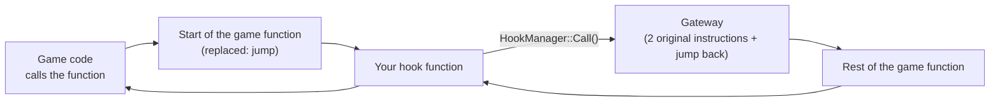

# Hooks and addresses

This page explains how the plugin finds the code of the game and how it changes it.

## Addresses

The code and the data of the game are in memory. Each function and each
variable has an **address**: a number that tells where it is.

Each domain has a file `address.h` with its addresses:

```cpp
// lib/include/pokemon/address.h
constexpr uptr kAddPokemonToTeam = GAME_ADDRESS(0x0039FA78, 0x003B6754);
```

`GAME_ADDRESS(xy, oras)` contains two addresses:

- The first value is for Pokémon X v1.5.
- The second value is for Alpha Sapphire v1.4.

The build selects one value (see `lib/include/core/game.h`).
The value `0` means that nobody found the address for this game yet.
The library ignores a hook or a patch at the address `0`.

> **Important:** An address is correct only for one version of one game.
> This is why the plugin needs Alpha Sapphire **v1.4**.

### Where the code is

| Memory | Contents |
|---|---|
| `0x00100000` and above | The main code of the game (`code.bin`). It is always in memory. |
| `0x006F3000` and above (ORAS) | The **CRO** modules: code that the game loads only when it needs it. The overworld code and the battle code use the same memory, one at a time. |
| `0x08000000` and above | The heap: the objects that the game makes while it runs. |

A hook in a CRO works only when the CRO is in memory. The library installs
these hooks disabled. It enables them when the process of the CRO starts.
For example, `battle::Battle::PatchLoad()` enables the battle hooks.

## Hooks

A **hook** redirects a function of the game to a function of the plugin.



When the plugin installs a hook:

1. It copies the first two instructions of the game function (8 bytes).
2. It writes a jump to your function at the start of the game function.
3. It makes a **gateway**: the two copied instructions, then a jump back to the game function.

When your function calls `core::HookManager::Call()`, the gateway runs the
**original function**.

### Use a hook

```cpp
#include "core/hook_manager.h"

// 1. The hook function. It has the same parameters and the same return
//    type as the game function.
static bool AddPokemonToTeamHook(savedata::PokemonTeam* team,
                                 savedata::PokemonParam* pokemon) {
  // Your code before the original function.
  bool result = core::HookManager::Call<bool>(HookId::kProduct0, team, pokemon);
  // Your code after the original function.
  return result;
}

// 2. Install the hook one time, at the start of the plugin.
void InstallMyHooks() {
  core::HookManager::Initialize(HookId::kProduct0,
                                pokemon::address::kAddPokemonToTeam,
                                (uptr)AddPokemonToTeamHook);
}
```

| Function | What it does |
|---|---|
| `HookManager::Initialize(id, address, function, enable = true)` | Prepares the hook. When `enable` is `true`, it also installs the hook. |
| `HookManager::Call<R>(id, args...)` | Calls the original function. `R` is the return type. |
| `HookManager::Enable(id)` | Installs the hook if it is not installed. |
| `HookManager::ForceEnable(id)` | Installs the hook again. Use it when the game loads a CRO again. |
| `HookManager::Disable(id)` | Removes the hook. The game function is normal again. |

Each hook needs a **hook id** (`core::HookId`). A product uses the free ids
`HookId::kProduct0` to `HookId::kProduct15`.

### The rules of a hook

1. **The signature must be correct.** The parameters and the return type must
   be the same as the game function. A wrong signature stops the game.
2. **A member function receives the object first.** In the game, a member
   function `Foo::Bar(int)` is a function `Bar(Foo* self, int)`.
3. **Call the original function** if the game needs its result or its side effects.
4. **Keep the hook fast.** The game can call it many times in each frame.
5. **The first two instructions must not use the `pc` register.** The gateway
   moves these instructions to a different address. An instruction that reads
   `pc` then reads a wrong value. Look at the disassembly before you hook.

## Patches

A **patch** writes new values in the memory of the game. The macros are in
`lib/include/core/memory.h`.

| Macro | What it does |
|---|---|
| `READ32(address)`, `READ16`, `READ8`, `READF` | Reads a value. |
| `WRITE32(address, value)`, `WRITE16`, `WRITE8`, `WRITEF` | Writes a value. |
| `ARM_NOP(address)` | Replaces one instruction with "do nothing". |
| `ARM_RET(address)` | Replaces one instruction with "return". |
| `ARM_RETURN_TRUE(address)` | Replaces two instructions with "return true". |
| `MEMORY_SCOPE(address, size)` | Makes a memory zone writable until the end of the current block. |

The code of a CRO is read-only. Use `MEMORY_SCOPE` before you write to it:

```cpp
void PatchLoad() {
  MEMORY_SCOPE(sys::address::kMemoryRegionCro, 0xF1000);
  ARM_NOP(address::kSomeInstruction);
}
```

## Find a new address

To find an address, you must study the code of the game. This is reverse
engineering. It is an advanced subject. These are the main steps:

1. Dump the code of your game (`code.bin`) with GodMode9 or with Azahar.
2. Open it in a disassembler, for example [Ghidra](https://ghidra-sre.org).
   Use the processor "ARM v6, little endian" and the base address `0x00100000`.
3. Find the function. Start from a value that you know: a text, a number, a
   function that the library already uses.
4. Test the address with a hook that writes to the log.
5. Add the address to the `address.h` file of the domain.

Look at the existing addresses and hooks of the library first.
The function that you need is often near a function that the library already knows.
