# Pokémon Sango Kaizo (Demo)

## Installation & Quick Start
Before installing the plugin, ensure you have the base game and update installed:
* **Base Game:** Pokémon Alpha Sapphire - [Download via hShop](https://hshop.erista.me/t/2475)
* **Update (v1.4):** [Download via hShop](https://hshop.erista.me/t/2896)

**Note:** If you already have existing save data, make sure to back it up using **Checkpoint** so you can restore it later if you want to play normally. For this mod, you must start from a fresh, clean save file.

Once the game and update are ready:
* **Consoles (Luma3DS):** Place `pokemon-sango-kaizo.3gx` into `sdmc:/luma/plugins/000400000011C500/` and make sure to enable the Plugin Loader in the Rosalina menu.
* **Emulators (Azahar):**
    * Go to `File` > `Open Azahar folder`, navigate to `sdmc/luma/plugins/000400000011C500/` (create the folders if they don't exist), and place `pokemon-sango-kaizo.3gx` there.
    * **Enable Plugin Loader:** Go to `Emulation` > `Configure` > `System` > check **Enable 3GX Plugin Loader**.

## Project Overview & Technical Details
* **Memory-Based Modding:** Unlike traditional ROM hacks (such as *Star Sapphire*), this project does not modify the game's file system (`romfs`). It relies entirely on live memory manipulation. Installation is incredibly lightweight: it only requires Pokémon Alpha Sapphire v1.4 and the execution of a custom plugin (`*.3gx`).
* **Current Status:** This is currently a demo version playable up to the first Gym badge. Routes and trainer teams beyond this point have not yet been coded. Community feedback is highly encouraged to refine the experience before the final release.

## The PokéPhone (Integrated QoL Menu)
*Accessed by pressing Select/Start, this device centralizes all Quality of Life (QoL) features:*
* **Custom Camera Angles:** Switch between default, 1st-person, free-rotating, top-down, and 3rd-person views.
* **Game Speed:** Toggle between x1 and x2 speed (capped at x2 to preserve the game's atmosphere).
* **Radio System:** Overworld background music is disabled by default for realism - though sound effects and Pokémon cries are preserved exactly as they are. However, the built-in radio app allows you to play any track of your choice while exploring (press **A** to apply track changes).
* **Built-in HMs:** HM moves (Cut, Fly, Surf, Waterfall, etc.) are executed directly from the menu. Say goodbye to HM slaves!
* **Portable PC & Apps:** Access the PC, Move Relearner, and other utilities from anywhere without needing to visit specific buildings.
* **Instant Repel:** Toggle wild encounters on and off directly from the menu - no more buying and applying Repels.

<table>
  <tr>
    <td>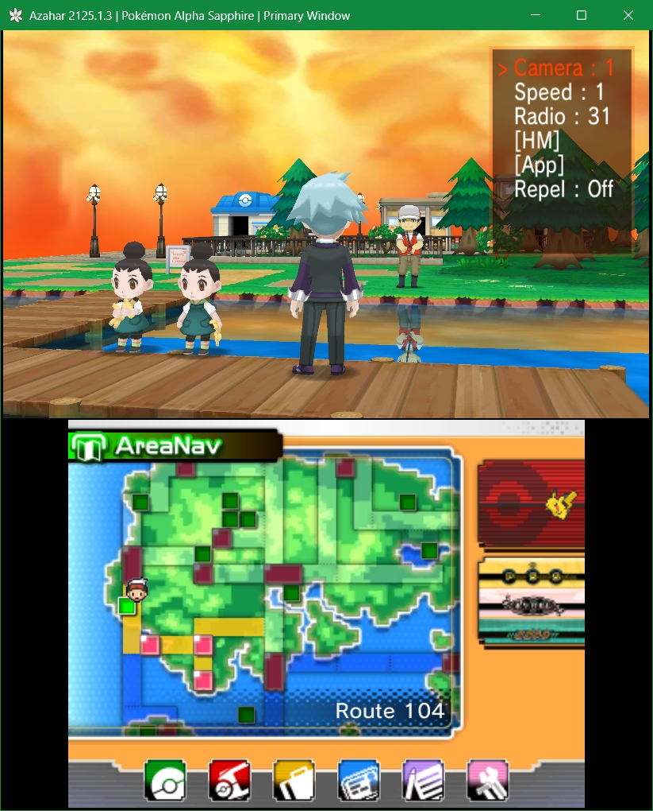</td>
    <td>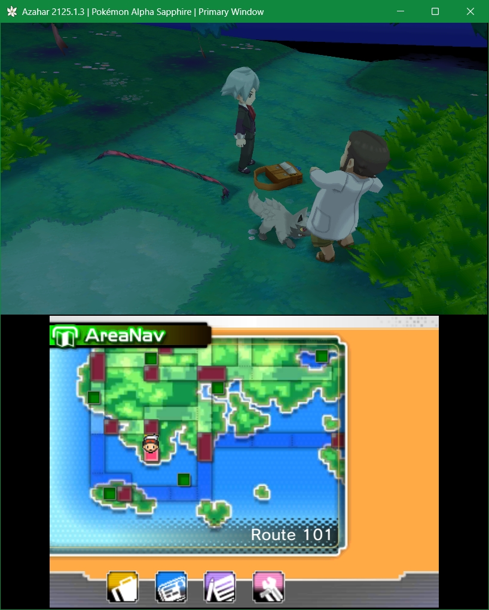</td>
  </tr>
  <tr>
    <td>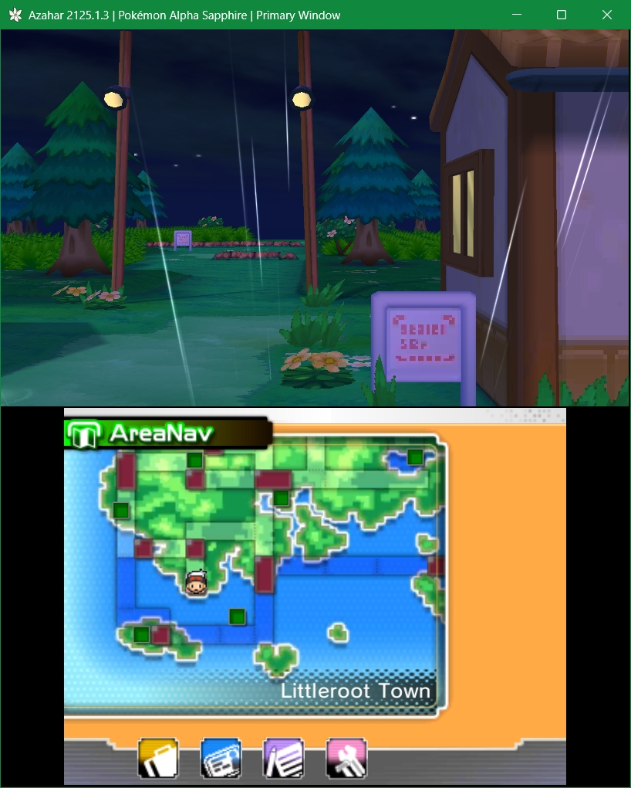</td>
    <td>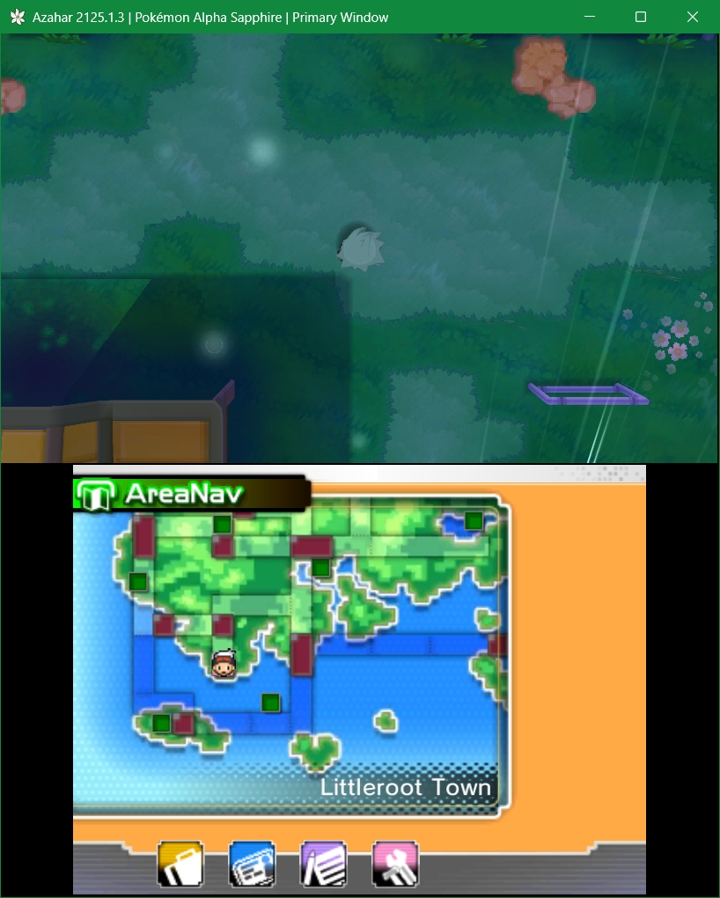</td>
  </tr>
</table>

## Kaizo Mechanics & Difficulty
* **Strict Nuzlocke Rules Hardcoded:**
    * You can only catch **one Pokémon per zone**.
    * **Permadeath:** If a Pokémon faints in battle, it is permanently deleted.
* **No Mid-Battle Items:** Access to the bag is disabled during trainer battles (except for Poké Balls). All healing and boosting items have been rendered entirely useless and are deleted from your inventory.
* **Anti-Stall & Nerfs:**
    * Overpowered Pokémon have been nerfed (e.g., Abilities changed for Mega Gengar and Mega Blaziken; Base Stats lowered for Kangaskhan, Lucario, etc.).
    * Setup and "toxic" moves (Dragon Dance, Calm Mind, Substitute, Protect) are restricted to 1 or 2 PP to prevent sweeping and stalling.
* **Legendary Ban:** Any Legendary Pokémon gifted to you via the story is automatically deleted to maintain Kaizo difficulty.

## Dynamic World & Encounters
* **True Dynamic Weather:** Weather is no longer tied to specific locations. It operates on a global, time-based probability system with varying durations for sun, rain, sandstorm, etc.
* **Thematic Biomes:** Wild encounters are strictly themed by route.
    * *Route 101:* Canines
    * *Route 103:* Rodents
    * *Route 102:* Felines
    * *Route 104:* Birds
    * *Petalburg Woods:* Caterpillars
* **Balanced Spawns:** Every zone features at least one Pokémon from each generation (typically capped at 8 species per route) with a completely equal (1/N) encounter rate.
* **Dynamic Level Scaling:** Wild Pokémon levels are mathematically scaled based on the average level and standard deviation of your current team.
* **Clean Overworld:** Black character outlines are disabled by default for a cleaner aesthetic.  
  And shaking grass and the DexNav radar have been disabled (for the moment).

<table>
  <tr>
    <td>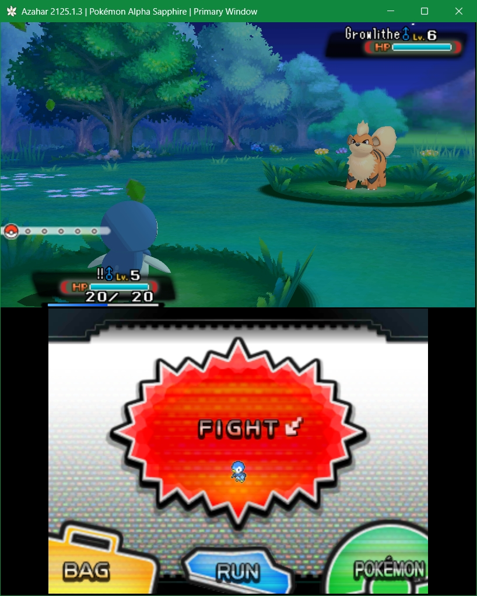</td>
    <td>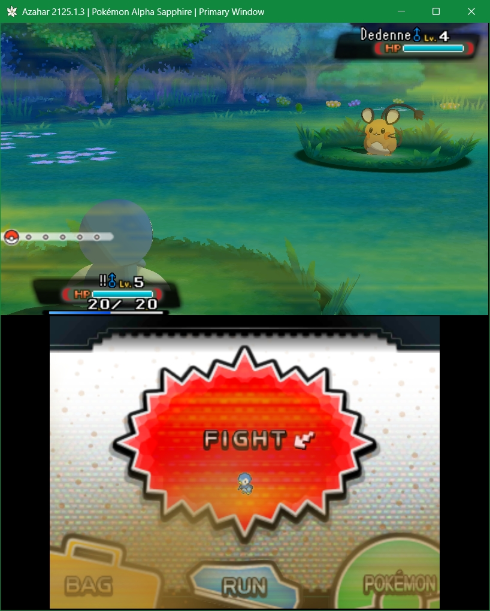</td>
  </tr>
</table>

## Overhauled Trainer AI & Battles
* **Competitive AI Teams:** Trainers match their route's biome (e.g., Bird Keepers in the avian route) and use fully optimized competitive Pokémon (Max IVs/EVs, strong movesets). They use the highest tier of battle AI.
* **Adaptive Trainer Scaling:** Trainer levels are dynamically scaled based on your team's average level, max level, and Base Stat Total (BST).
    * If the opponent's team has a much higher BST than yours, the game applies a proportional nerf to keep things fair.
    * Horde battle levels are halved, and random variations are injected to keep battles unpredictable.
* **Bespoke Trainer Encounters:** Every trainer has a custom setup including specific terrain, weather, intro animations, and battle format (Single, Double, Triple, Rotation, or Horde).
* **Experimental Battle Modes:** Encounter unique battle modifiers, such as:
    * Type-chart inversion.
    * Stat inversion (Attack swaps with Sp. Atk, Defense swaps with Sp. Def).
    * Metronome-only battles.
    * *Sudden Death:* If one Pokémon on your team dies, your entire team dies, ending your session.

<table>
  <tr>
    <td>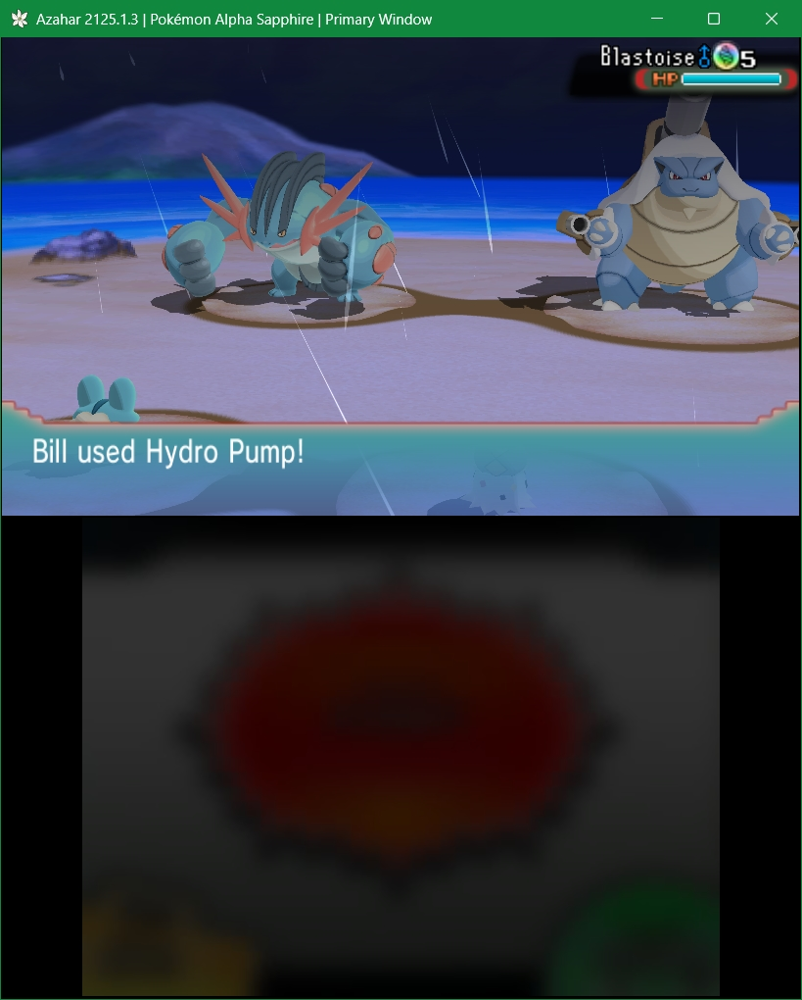</td>
    <td>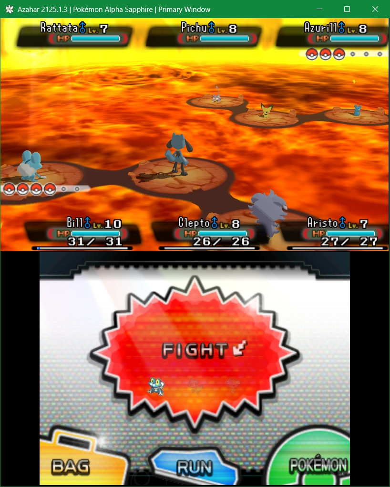</td>
    <td>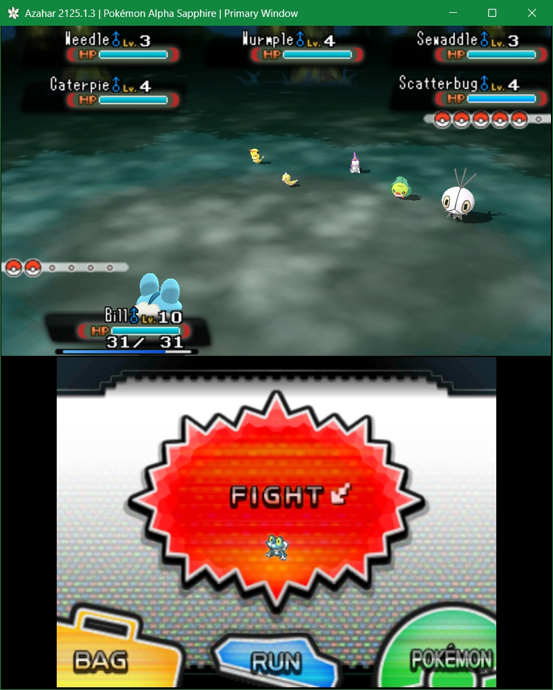</td>
  </tr>
</table>

## Instant Team Building (No Grind)
* **Auto-Heal:** Surviving Pokémon are fully healed after every battle. Pokémon Centers are obsolete.
* **Unlimited Resources:** Start the game with infinite Poké Balls, evolution stones, and competitive items.
* **Upgraded TMs:** All TMs have been replaced with highly viable, competitive moves.
* **Live Stat Editor:** Press 'Y' in the menu to instantly edit a Pokémon's IVs, EVs, Ability, and Nature. EVs are still legally capped at 510. Press 'X' to reset stats.
* **Unrestricted Nicknames:** Zero restrictions apply to Pokémon nicknames - you can use any length, combine over 5 digits, or include explicit profanity.
* **Quality of Life Evolutions:** Trade evolutions now trigger by simply leveling up (Lv. 30) or by using their specific trade item like an Evolution Stone. Eggs hatch instantly.
* **Accessible Shinies (1/8 Rate):** The Shiny rate is drastically increased to 1/8. The goal is to encourage aesthetic customization and diverse teams without making them completely common.

<table>
  <tr>
    <td>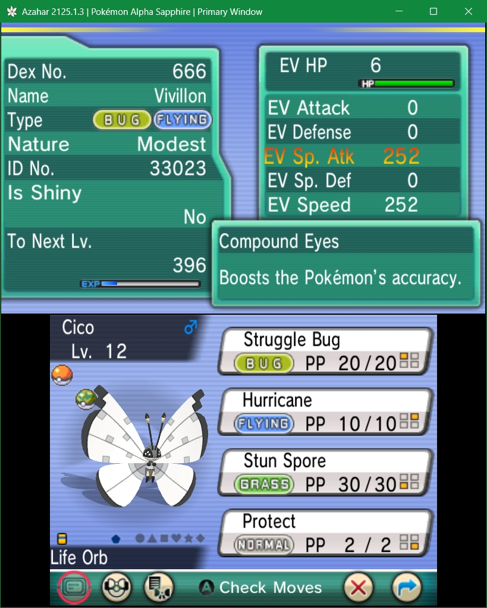</td>
    <td>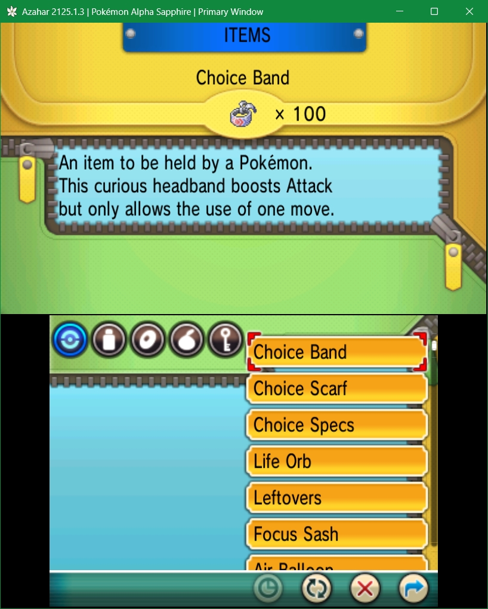</td>
    <td>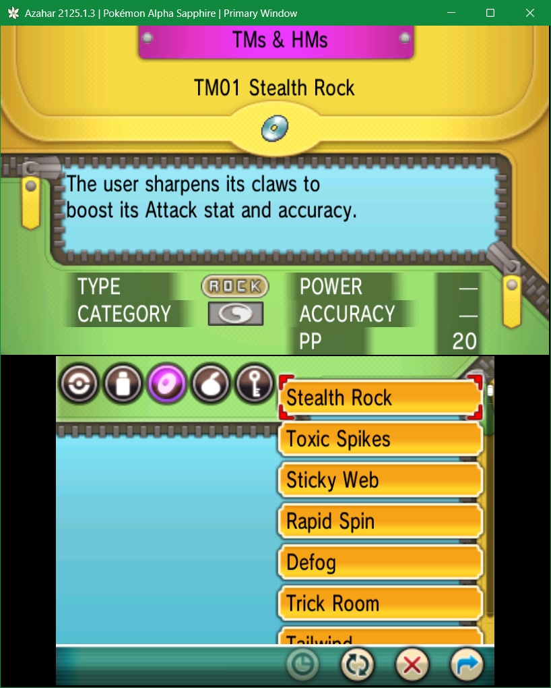</td>
  </tr>
</table>

### How to use the Pokémon Editor:
* **Press Y:** Toggle edit mode (navigation to select a stat, highlighted in red/yellow).
* **Press L / R:** Switch between pages (IVs, EVs, and actual stats).
* **Press A:** Enter edit mode on a selected stat (highlighted in purple/pink).
* **Adjust values:** **Left/Right** (+/-1), **Up/Down** (+/-10), **L/R shoulders** (+/-100).
* **Press X:** Max out contest stats and IVs (31) & Reset EVs.

## Visuals, UI, & Battle Aesthetics
* **No Waiting:** Text appears instantly (no scrolling). Long battle intros and Poké Ball-throwing animations are completely skipped - Pokémon spawn instantly on the field. Battle animations remain enabled for visual flair.
* **Custom HP Bar:** The traditional Green/Yellow/Red HP bar is replaced with a smooth Cyan-to-Magenta gradient. Every single HP lost triggers a slight color transition.
* **True Sizing & Vibrant Colors:** Pokémon models are scaled to their accurate lore sizes (no adjustments to fit the screen). Model textures have been re-saturated to bring back the vibrant, flashy colors of older generations.
* **Bottom Screen Menu Backgrounds:** The bottom screen menu during battles features randomized backgrounds from Pokémon X/Y.
* **Simplified Captures:** All Poké Balls are purely cosmetic and share the exact same catch rate (including the Master Ball).
* **Mega & Shiny Aesthetics:** Mega Evolutions use the full, long animation. The standard "star sparkle" animation for Shinies is disabled.

## Story & Character Alterations
* **You are Steven Stone:** Character creation is bypassed. You automatically play as Steven Stone (PSS icon, overworld and cutscene models replaced). May's model has been replaced by Zinnia.
* **NPC Swaps:** Brendan’s mother is replaced by Steven's father, etc.
* **Randomized Starters:** You will be offered a completely random Grass, Fire, and Water Pokémon as your starter. You can save right in front of them and restart the game to try to get the desired starter (or Shiny).
* **Revamped Intro & Title Screen:**
    * The title screen plays custom videos: Shiny Primal Kyogre on the top screen, Shiny Primal Groudon on the bottom screen.
    * Pressing 'A' plays Beldum's cry.
    * The intro sequence replaces standard Pokémon with Legendaries, Shinies, Megas, and alternate forms (e.g., Zigzagoon becomes Groudon, Skitty becomes Kyogre, Latias becomes Shiny Beldum, and Swellow flies away in a nod to Steven).

<table>
  <tr>
    <td>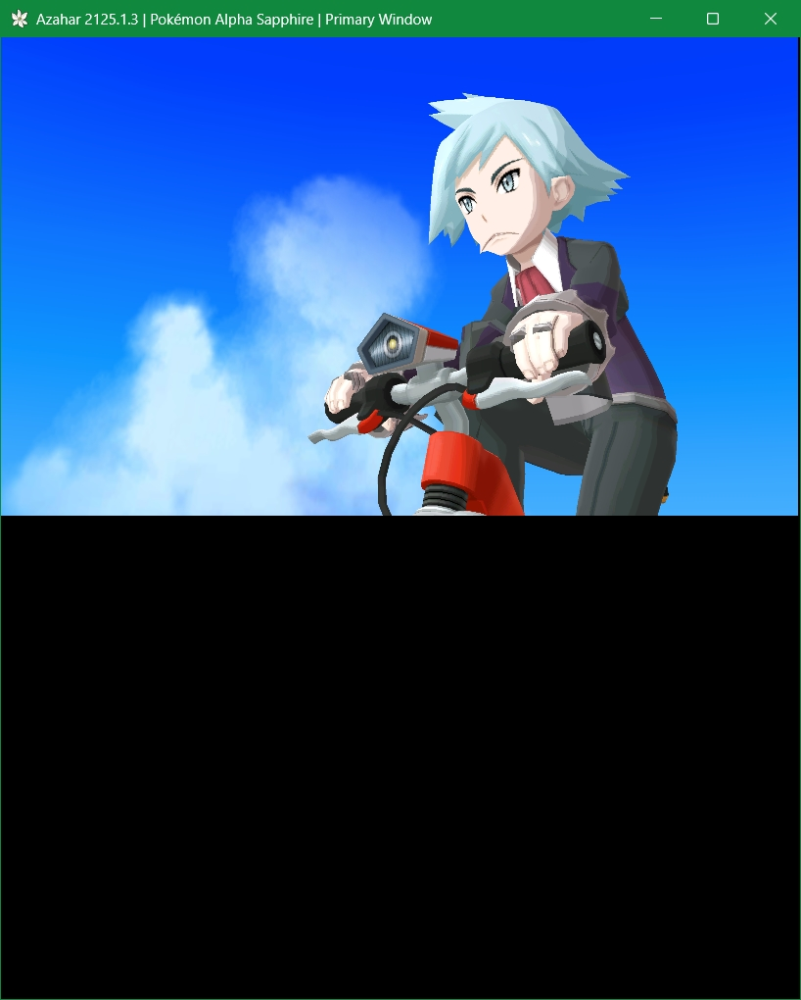</td>
    <td>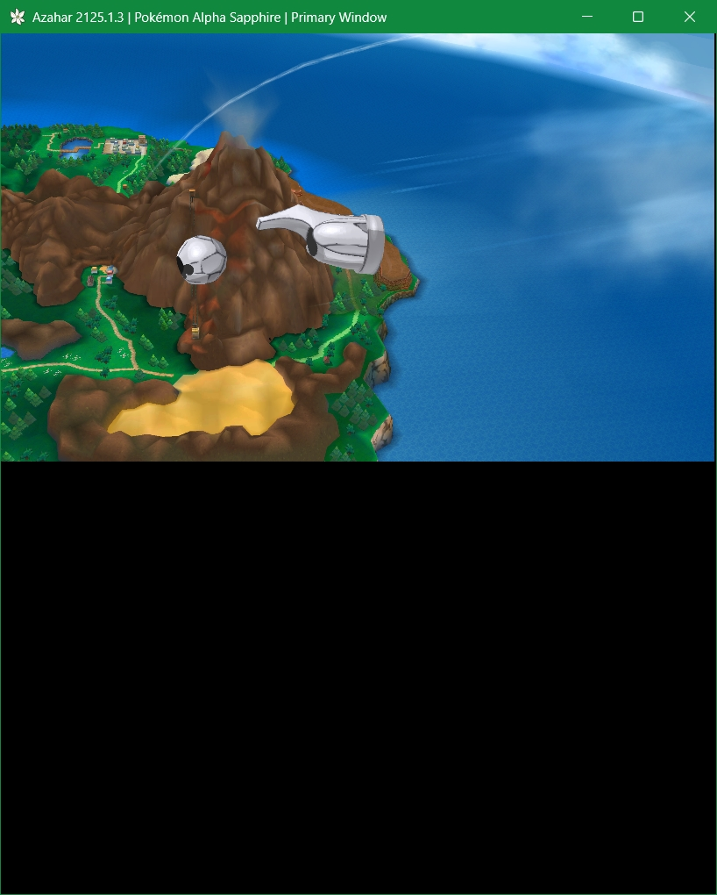</td>
    <td>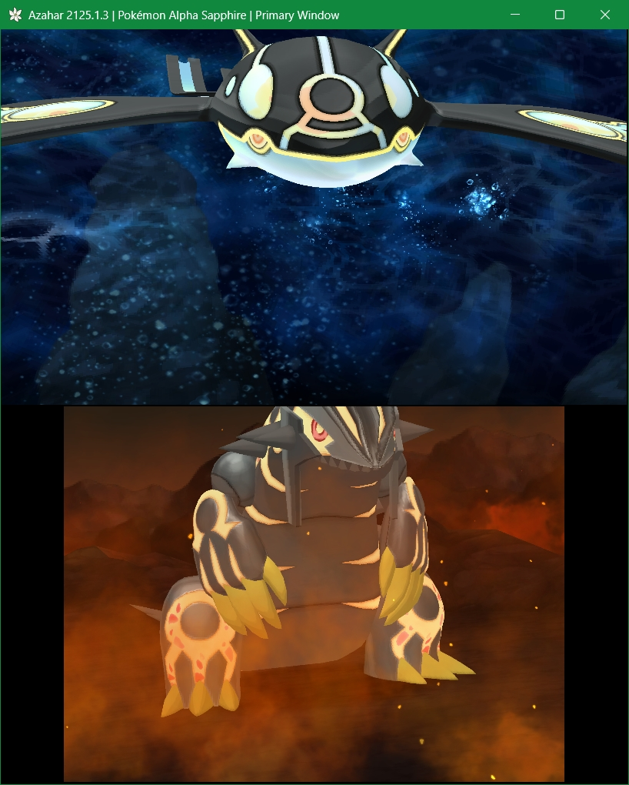</td>
  </tr>
  <tr>
    <td>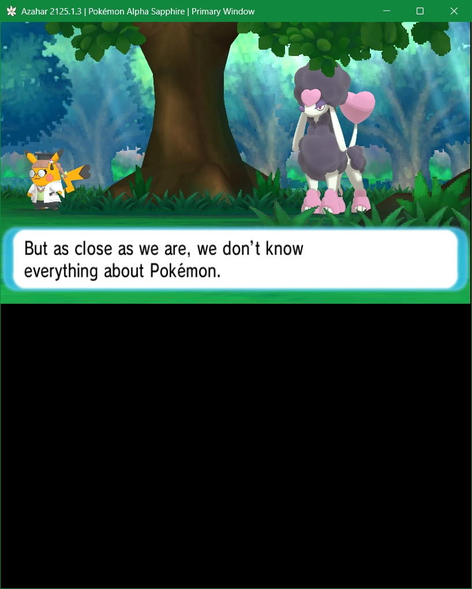</td>
    <td>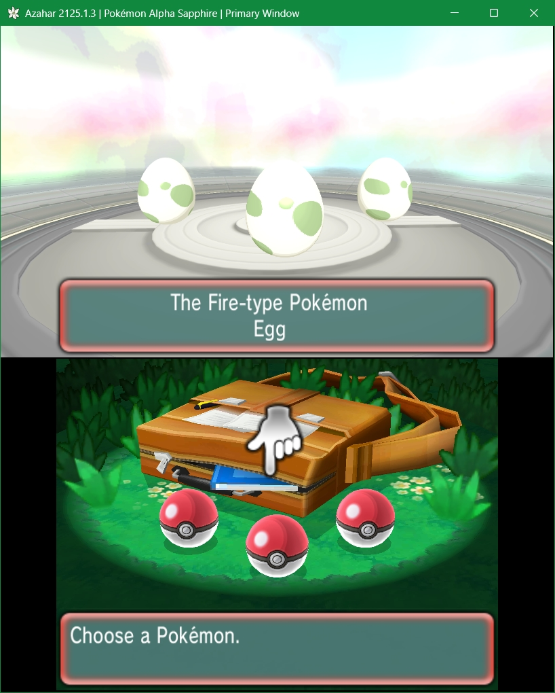</td>
  </tr>
</table>